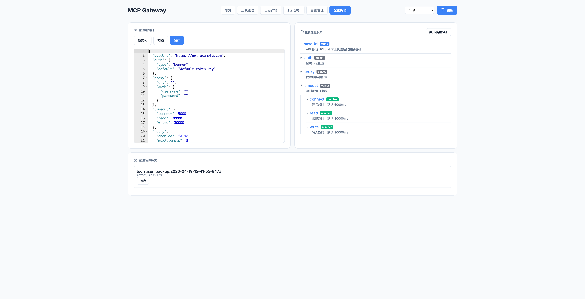

# MCP HTTP Gateway

一个基于 MCP 协议的 HTTP 网关服务，将 LLM 工具调用请求转发到 HTTP REST 接口。

---

## 核心能力

### 1. 熔断器（Circuit Breaker）

防止故障扩散，保护后端服务稳定性。

```json
{
  "circuitBreaker": {
    "enabled": true,
    "failureThreshold": 5,    // 连续失败 5 次触发熔断
    "successThreshold": 2,    // 连续成功 2 次恢复
    "halfOpenTime": 30000     // 熔断后 30s 尝试恢复
  }
}
```

**状态流转**：
- `CLOSED` → 正常状态，请求正常转发
- `OPEN` → 熔断状态，拒绝所有请求，直接返回错误
- `HALF_OPEN` → 半开状态，允许少量请求探测恢复

### 2. 降级策略（Fallback）

服务失败时的兜底机制，确保用户获得响应。

```json
{
  "fallback": {
    "enabled": true,
    "useExpiredCache": true,  // 使用过期缓存兜底
    "useMockAsFallback": true // 使用 Mock 数据兜底
  }
}
```

**降级链路**：
```
真实服务 → 失败 → 缓存（忽略 TTL） → 失败 → Mock → 失败 → 错误
```

**适用场景**：
- 后端服务不可用时，返回缓存数据保证可用性
- 缓存也失效时，返回 Mock 数据避免空白响应
- 适合对实时性要求不高、但需要保证响应的场景

---

## 快速部署

### npx 方式（推荐）

无需安装，直接运行：

```bash
npx -y mcp-http-gateway --config /path/to/tools.json
```

在 Claude Desktop 中配置（`~/.claude/settings.json`）：

```json
{
  "mcpServers": {
    "http-gateway": {
      "command": "npx",
      "args": ["-y", "mcp-http-gateway", "--config", "/absolute/path/to/tools.json"]
    }
  }
}
```

### 本地部署

```bash
# 克隆项目
git clone <repository-url>
cd mcp-http-gateway

# 安装依赖
npm install

# 编译
npm run build

# 运行
node dist/cli.js --config ./tools.json
```

在 Claude Desktop 中配置：

```json
{
  "mcpServers": {
    "http-gateway": {
      "command": "node",
      "args": ["./dist/cli.js", "--config", "./tools.json"]
    }
  }
}
```

### 启用监控面板

添加 `--http` 参数启用 HTTP 服务：

```bash
node dist/cli.js --config ./tools.json --http
```

访问监控面板：`http://localhost:11112/dashboard`

---

## 配置信息查看

### Dashboard 配置编辑页面

访问 `http://localhost:11112/dashboard`，点击「配置编辑」：



- **左侧**：JSON 配置编辑器（Ace Editor，语法高亮）
- **右侧**：配置属性说明面板，点击展开查看每个属性的含义
- **底部**：配置备份历史，支持一键回滚

### 配置属性说明面板功能

- 查看所有配置模块及其子属性
- 点击展开查看详细说明和默认值
- 类型标签颜色区分：`string`（蓝）、`number`（绿）、`boolean`（橙）、`object`（灰）
- 「展开/折叠全部」按钮批量操作

### API 查询配置

```bash
# 获取当前配置
curl http://localhost:11112/api/config

# 获取配置备份列表
curl http://localhost:11112/api/config/backups

# 回滚到指定备份
curl -X POST http://localhost:11112/api/config/restore/<backup-file>
```

---

## 最小配置示例

```json
{
  "baseUrl": "https://api.example.com",
  "tokens": {
    "default": "your-api-token"
  },
  "tools": {
    "getUser": {
      "description": "根据ID获取用户信息",
      "method": "GET",
      "path": "/user/{userId}",
      "queryParams": {
        "userId": {
          "description": "用户ID",
          "type": "string",
          "required": true
        }
      }
    }
  }
}
```

---

## CLI 参数

| 参数 | 说明 |
|------|------|
| `--config <path>` | 配置文件路径（默认：./tools.json） |
| `--http` | 启用 HTTP 监控面板 |
| `--transport <mode>` | 传输模式：stdio / sse / all |
| `--sse-port <port>` | SSE 端口（默认：11113） |
| `--http-port <port>` | HTTP 端口（默认：11112） |

---

## 许可证

MIT